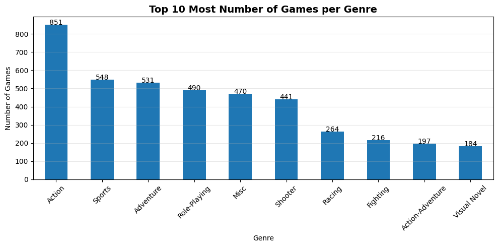
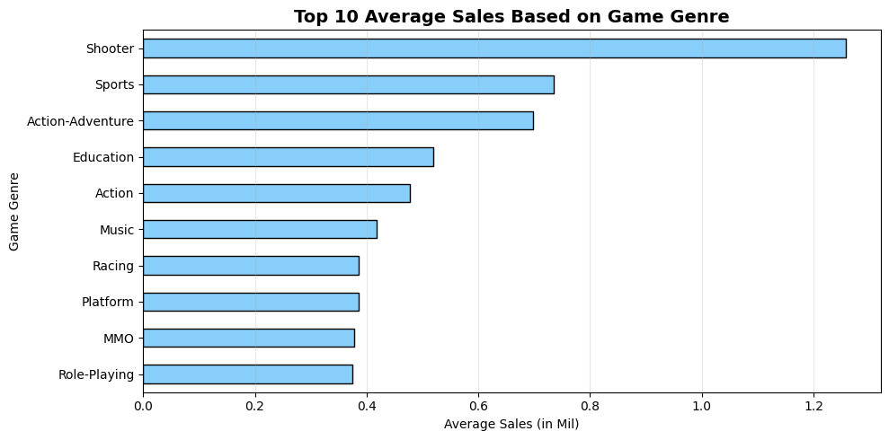
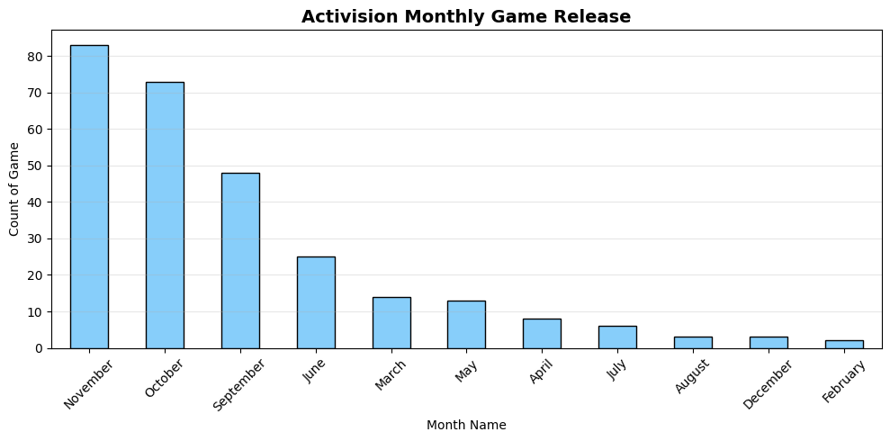
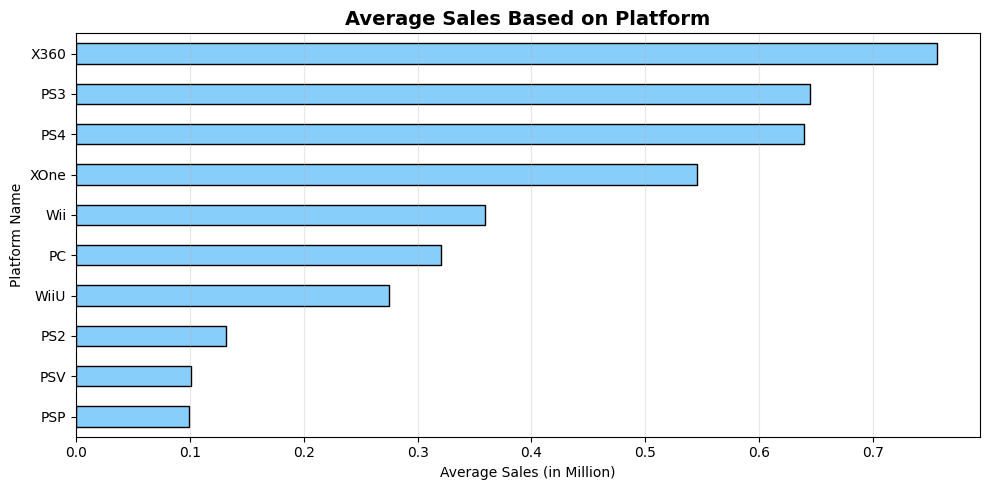

# Video Game Sales Analysis

This Project Analyze historical video game sales data (2010–2019) to identify trends in genre, platform, and release strategy that contribute to higher sales performance.

---

## Repository Outline

```bash
├── data/                   # Raw VideoGames Dataset   
├── images/                 # Analysis Preview   
├── notebook/               # Jupyter notebooks for analysis   
├── requirements.txt        # Python dependencies   
└── README.md               # Project overview explanation   
```

---

## Project Background

Over the past decade, the gaming industry has grown rapidly and evolved into a highly competitive market driven by changing consumer preferences. 
In this landscape, new publishers must strategically identify the optimal combination of genre, platform, and release timing to maximize their chances of success.

This project aims to analyze historical video game sales data (2010–2019) to identify patterns and trends that can support data-driven decision-making in game publishing strategies.

---

## SMART Objective

**Specific :** Identify the optimal combination of game genre, platform, and release timing for maximizing sales performance.  
**Measurable :** Measured using average global sales and regional sales distribution.   
**Achievable :** Based on historical video game sales dataset.    
**Relevant :** Supports new publishers in designing an effective launch strategy.   
**Time-bound :** Analysis using historical data from 2010–2019.   

---

## Problem Breakdown

- Which game genres and platforms generate the highest average sales?
- Which publishers dominate high-performing game genres?
- Which platforms contribute the most to overall game sales?
- When is the optimal release period with relatively lower competition?
- How can new publishers design an optimal launch strategy based on these insights?

---

## Dataset Information

- Source: [Kaggle / Video Game Sales Dataset](https://www.kaggle.com/datasets/lamskdna/video-games-sales/data?select=VideoGames_Sales.xlsx)
- Period: 2010–2019
- Features:
  - Title
  - Console
  - Genre
  - Publisher
  - Developer
  - Critic Score
  - Total Sales (mil)
  - NA Sales (mil)
  - JP Sales (mil)
  - Pal Sales (mil)
  - Other Sales (mil)
  - Release Date

---

## Tech Stack

### Programming Language
- Python

### Libraries
- Pandas
- Scipy
- Matplotlib

### Environment
- Jupyter Notebook

---

## Analysis Workflow

1. Data Loading
2. Data Cleaning
3. Exploratory Data Analysis (EDA)
    - Descriptive Statistic
    - Inferential Statistic
    - Genre Analysis
    - Publisher Analysis
    - Release Timing Analysis
    - Platform Analysis
4. Conclusion

---

## Analysis Preview

### 1️⃣ **Descriptive Statistic**
  
  <br>
### 2️⃣ **Genre Analysis**
  
  <br>
### 3️⃣ **Publisher Analysis**
  .png "Publisher Analysis")
  <br>
### 4️⃣ **Release Timing Analysis**
  
  <br>
### 4️⃣ **Platform Analysis**
  

---

## Conclusion

As a new Publisher in video game, sales performance is influenced by a combination of genre selection, platform choice, and release timing rather than sheer production volume.

While the Action genre dominates in terms of the number of releases, it does not translate into the highest average sales, indicating a saturated and highly competitive market. In contrast, the Shooter genre shows the strongest revenue potential, making it a more optimal choice for new publishers.

From a platform perspective, Xbox 360 emerges as the most favorable platform due to its consistently higher average sales compared to others. Additionally, release timing plays a critical role, as major publishers concentrate their launches in peak periods such as October and November, creating intense competition.

Therefore, launching in lower-competition periods, particularly February, provides a strategic advantage for new entrants to gain visibility and maximize performance.

Overall, a data-driven launch strategy that combines high-performing genre (Shooter), strong platform (Xbox 360), and optimal timing (February) significantly increases the likelihood of commercial success for new publishers.


---